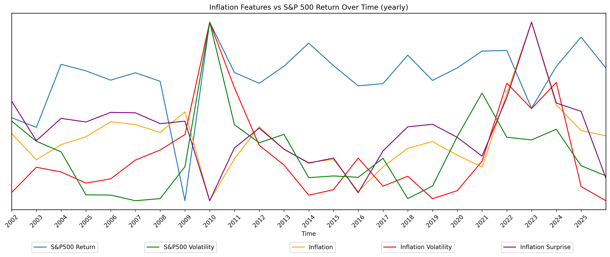
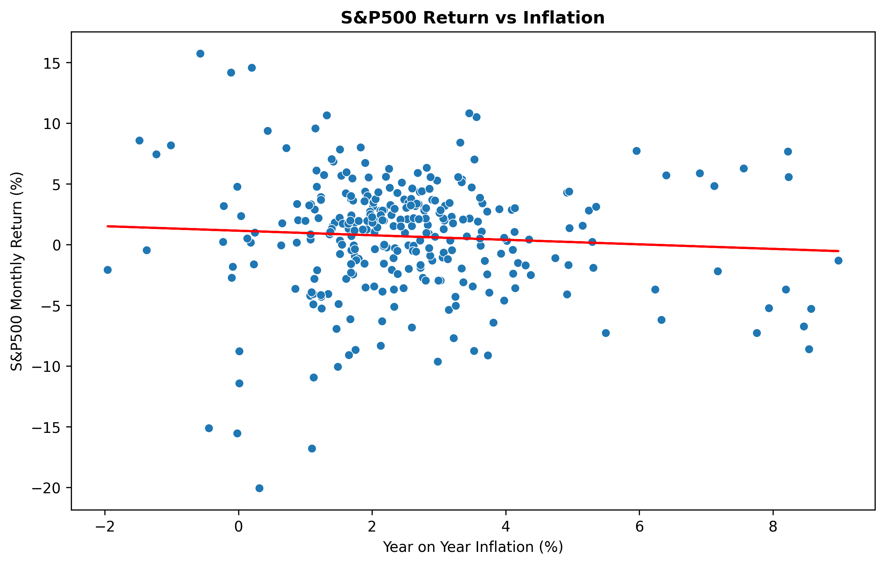
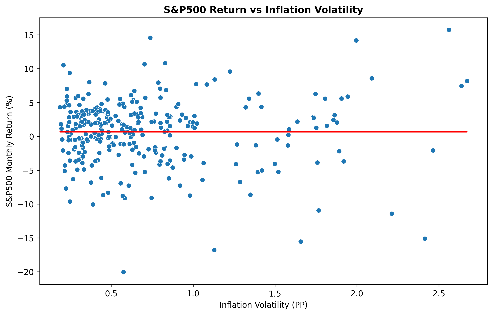
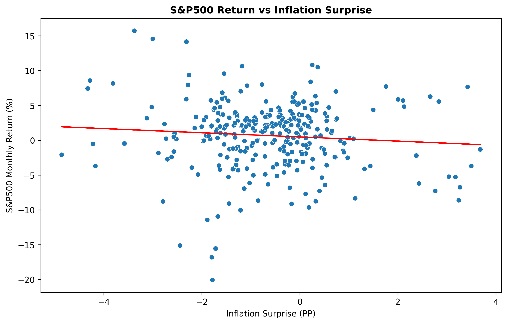
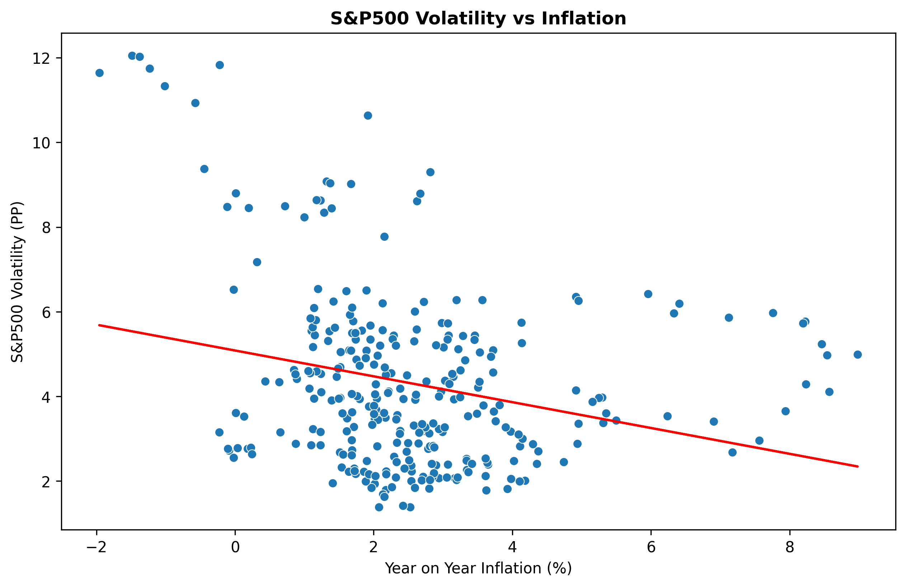
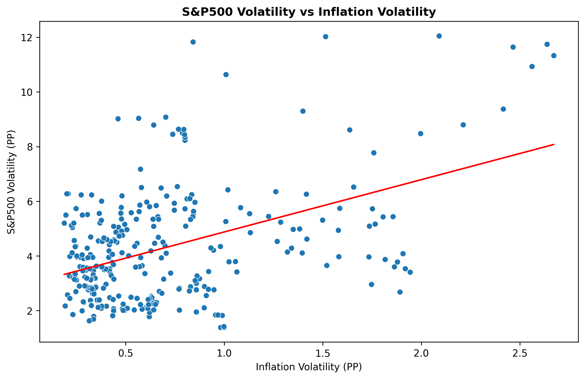
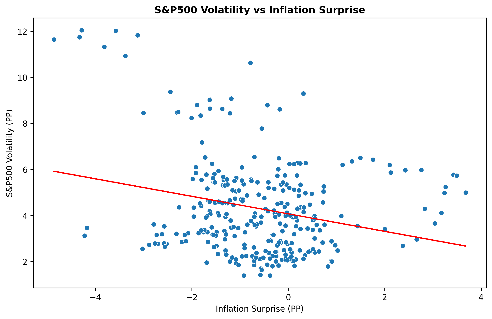

# Introduction

The stock market plays an essential role in the global economy, aggregating vast amounts of economic data and combining with consumer sentiment to value over 58000 publicly listed companies. The S&P 500 is often considered the best gauge for large cap American stocks, making up around 80% of the US's market cap. Due to its prevalence it is closely monitored by policy makers to evaluate economic health and is used by institutions and individual investors as a bench mark for performance. 

Among macroeconomic indicators such as GDP growth and unemployment rate, inflation plays a significant role in influencing interest rates, firm profitability and investor expectations. Although inflation is known to have a key role in the valuation of equities in the market, the individual elements of inflation and their exact influence on the market remains largely ambiguous. 

This report therefore aims to reveal how three inflation metrics correlate to two core performance measures of the S&P500 by answering the following research question:

*How do Inflation Metrics Correlate with S&P500 Returns and Volatility?*

**Inflation Metrics:**

- **Inflation level** (year on year CPI),  
- **Inflation volatility** (rolling 12 month standard deviation of inflation)  
- **Inflation surprise** (Difference between inflation and inflation expectations)

**S&P500 Measures:**

- **S&P500 monthly returns** 
- **S&P500 volatility** (rolling  12-month standard deviation of returns). 

# Data: 

## collection 

Inflation data is easily obtainable from the FRED using the "fredapi" library in python and a private API key collected by creating an account with the FRED. This report utilises two datasets from the FRED: 1) CPIAUCSL, which contains monthly data on cpi for all urban consumers in the USA (seasonally adjusted) and 2) MICH, which contains monthly data on University of Michigan consumer inflation expectations.  

S&P500 data can be retrieved from yahoo finance using the yfinance python library using the S&P500 ticker "^GSPC". Unlike the FRED S&P500 data is recorded daily excluding weekends and bank holidays, thus data had to be resampled to monthly by extracting the first record from each month. Redundant columns were removed so the data frame contained only the date and the corresponding S&P500 closing value. Missing values were filled using the pandas function "interpolate()".  

In this report a 25 year window will be used, taking data from 2001/01/01 - 2025/12/31, resulting in 300 records. 

## Calculations 

The following variables were constructed for the analysis:

**S&P500 Monthly Returns(%):** 
$$
\color{gray}{
R_t = \frac{S\&P500_t - S\&P500_{t-1}}{S\&P500_{t-1}} \times 100
}
$$

**S&P500 volatility(%):**
$$
\color{gray}{
\sigma_t = \sqrt{\frac{1}{n-1} \sum_{i=0}^{n-1} (R_{t-i} - \bar{R}_t)^2}, \quad n = 12
}
$$
> Note: This can be calculated using pandas functions: 
`R.rolling(12).std()`


**Year-on-year Inflation(%):**
$$
\color{gray}{
\pi_t = \frac{CPI_t - CPI_{t-1}}{CPI_{t-1}} \times 100
}
$$

**Inflation volatility(%):** 
$$
\color{gray}{
\sigma_t = \sqrt{\frac{1}{n-1} \sum_{i=0}^{n-1} (R_{t-i} - \bar{R}_t)^2}, \quad n = 12
}
$$
> Note: This can be calculated using pandas functions: 
`π.rolling(12).std()`

**Inflation surprise(PP):** 
$$
\color{gray}{
S_t = Inflation - Inflation Expectations
}
$$

# Analysis

## Time series

To set the scene for my analysis, *Figure 1A* displays a combined time series for all 5 of my variables of interest sampled monthly - with *Figure 1B* abstracting further to a yearly sample frequency. From first glance the figures portray some noticeable features: Large market volatility from mid 2008 - mid 2010 (the Global Financial Crisis) and 2020-2021 (Covid 19), there appears to be some positive correlation between S&P500 volatility and inflation volatility and inflation and inflation surprise seem to be positively correlated. 

::: {layout-nrow=2}
{fig-alt="Combined Time Series"}
{fig-alt="Combined Time Series"}
:::

**Figure 1.** *Time‑series plots of inflation metrics against S&P500 returns and volatility. Figure A (top) Monthly data frequency. Figure B (bottom) yearly data frequency.*

While the time series plots provide an initial overview of how inflation metrics and the s&P500 move over time, time series graphs are mostly useful for visualising the influence of major events such as the global financial crisis and Covid 19 and portraying long run trends. The value the time series provide in comparing relationships between variables is diminutive.  

## Scatter Plots

To begin investigating relationship between inflation metrics and S&P500 returns and volatility, scatter plots can be used to provide a visual representation and an intuitive preview of what later regressions may uncover. To aid in the visual interpretation a line of best fit has been plotted on each graph. A tightly bound trend around the line of best fit hints at a strong positive or negative relationship, conversely a cloud of points with no clearly visible pattern may point at a weak or absent correlation.  

On visual inspection of *Figure 2* there seems to be extremely little correlation between each of the inflation metrics plotted against S&P500 returns. Calculated r squared values are extremely small hinting that the relationship between inflation metrics and S&P500 returns is extremely week and running a simple linear regression yields extremely high P values, meaning any observable correlation is statistically insignificant. 

::: {layout-ncol=3}
{fig-alt="S&P500 Returns Against Inflation"}

{fig-alt="S&P500 Returns Against Inflation Volatility"}

{fig-alt="S&P500 Volatility Against Inflation Surprise"}
:::

**Figure 2.** *Inflation metrics: Inflation(A), inflation Volatility(B) and inflation surprise(C) against S&P500 returns.*

Looking into *Figure 3*, there is visual evidents of correlation between inflation metrics and inflation volatility albeit still relatively weak. On calculation P values are revealed to be extremely small hinting at a statistically significant relationship, however, r squared values also remain relatively small with the highest of them being 0.21 for inflation volatility against S&P500 volatility – meaning 21% of the variation in S&P500 volatility can be explained by inflation volatility. 

::: {layout-ncol=3}

{fig-alt="S&P500 Volatility Against Inflation"}

{fig-alt="S&P500 Volatility Against Inflation Volatility"}

{fig-alt="S&P500 Returns Against Inflation Surprise"}
:::

**Figure 3.** *Inflation metrics: Inflation(A), inflation Volatility(B) and inflation surprise(C) against S&P500 volatility.*

Somethings to note from inspecting the graphs: There seems to be heteroskedasticity so I should use robust standard errors later in my regressions. Additionally, there is visible clustering around the inflation level of 2-3%, inflation volatility from 0-1PP and inflation surprise of -2-1PP. Economically this makes sense given the FED's inflation target of 2% and inflation surprise being mostly negative due to a multitude of economic factors. Furthermore, the plots of inflation vs S&P500 volatility and inflation surprise vs S&P500 volatility look as if they may follow a nonlinear relationship, so this should be tested. 

## Regressions

Having visualised the relationships between inflation metrics and S&P500 returns and volatility, I now extend my analysis by modelling more complex regressions. Note throughout this analysis robust standard errors (HC1) are used in regressions to combat heterogeneity and coefficients are standardised to allow meaningful comparison between regressors.

To start , S&P500 returns were regressed on the three inflation metrics:

$$
R_t = \alpha + \beta_1 \pi_t + \beta_2 \sigma_t^{\pi} + \beta_3 S_t + u_t
$$


Our earlier assumption based off of figure 2 was confirmed, none of the inflation metrics had statistically significant relationship with S&P500 returns, with the model explaining almost none of S&P500 returns (Adj. R-squared -0.003). 

However, markets do not always react instantly to new information and price adjustments may be delayed. To test whether inflation metrics have predictive power on S&P500 returns I then regressed the same model but with the inflation metrics lagged by 1 month:

$$
R_t = \alpha + \beta_1 \pi_{t-1} + \beta_2 \sigma^{\pi}_{t-1} + \beta_3 S_{t-1} + u_t
$$

The results remain largely unchanged, with all metrics remaining statistically insignificant and adj. R-squared only increasing to 0.011, revealing past inflation conditions do not predict future S&P500 returns.

We now turn to investigate the relationship between the inflation metrics and S&P500 volatility. As noted earlier, visual inspection of *Figure 3A* and *Figure 3B* suggest a non-linear relationships of inflation and inflation surprise with S&P500 volatility. To account for this squared terms for each of these respective metrics have been included in the model: 

$$
\sigma^{SP500}_t = \alpha + \beta_1 \pi_t + \beta_2 \sigma^{\pi}_t + \beta_3 S_t + \beta_4 \pi_t^2 + \beta_5 S_t^2 + u_t
$$

As seen in *Figure 4*, this model explains 36.2% of the variation in monthly S&P500 volatility, a significantly stronger result than the models relating inflation metrics to S&P500 returns. All variables were statistically significant except the squared inflation surprise term. The model suggests that inflation volatility and inflation surprise both have a statistically significant positive correlation with S&P500 volatility, where a 1 standard deviation (SD) increase in either metric is associated with a 0.79 SD increase in S&P500 volatility. Conversely inflation has a statistically significant negative relationship with S&P500 volatility, where a 1 SD increase in inflation is associated with a 1.50 SD decrease in S&P500 volatility. 

```{python}
#| echo: false
with open("Outputs/Tables/regression_sp500_v.txt") as f:
    print(f.read())
```
**Figure 4.** *Regression results from regressing S&P500 volatility on inflation metrics.*

Following the previous approach, I will now regress S&P500 volatility on the inflation metrics lagged by 1 month, to understand the metrics' predictive effect on market volatility, as specified in the following model:

$$
\sigma^{SP500}_t = \alpha + \beta_1 \pi_{t-1} + \beta_2 \sigma^{\pi}_{t-1} + \beta_3 S_{t-1} + u_t
$$

Replacing lagged inflation variables in the model yeilds substantially different results, as shown in *Figure 5*. Inflation surprise is no longer statistically significant, the magnitude of the effect of inflation is reduced to -0.79 SD and the effect of inflation volatility increases to 1.00 SD. 

```{python}
#| echo: false
with open("Outputs/Tables/regression_sp500_v_volatility_persistence.txt") as f:
    print(f.read())
```
**Figure 5.** *Regression results from regressing S&P500 volatility on lagged inflation metrics.*

Economically the results for inflation volatility and inflation surprise make sense. Having high inflation volatility indicates high uncertainty regarding inflation. During these times, households and firms struggle to predict monetary policy response and real interest rates, leading to fluctuations in investment habits and asset pricing and therefore increased market volatility. Similarly, for inflation surprise, when households or firms wrongly predict inflation, they re-evaluate their expectations for future monetary policy and asset pricing, leading to fluctuations in the stock market, although unlike inflation volatility this effect is short-lived and does not contribute to market volatility in the following month. Additionally the positive and statistically significant squared term for inflation surprise indicates a nonlinear relationship, where large inflation surprises disproportionately increase volatility in the market. 

The negative coefficient for inflation suggests that in times of high inflation, where inflation volatility and inflation surprise are accounted for there is a negative relationship between stable and predictable inflation and S&P500 volatility. Additionally the VIF value between inflation and inflation surprise is 4.8 indicating moderate collinearity, thus making coefficient estimates less reliable.

To address multicollinearity between inflation and inflation surprise the following model will be run: 

$$ 
\sigma^{SP500}_t = \alpha + \beta_1 \pi^{std}_t + \beta_2 (\sigma^{\pi}_t)^{std} + u_t 
$$ 

After discarding inflation surprise from the model, the coefficient for inflation has been substantially reduced (from −1.49 to −0.6). This suggests the originally observed strong negative relationship was most likely overstated due to shared variation between inflation and inflation surprise. 

To explore further how inflation and inflation volatility jointly influence S&P500 volatility the following model will be run: 

$$
\sigma^{SP500}_t = \alpha + \beta_1 \pi^{std}_t + \beta_2 (\sigma^{\pi}_t)^{std} + \beta_3\left( \pi^{std}_t \cdot (\sigma^{\pi}_t)^{std} \right)+ u_t
$$

Similar to the previous models, as seen in figure 6 this model shows a strong and statistically significant positive relationship between inflation volatility and S&P500 volatility. The interaction term between inflation and inflation volatility is negative and also statistically significant. However, importantly inflation is now statistically insignificant with a p-value of 0.58. 

```{python}
#| echo: false
with open("Outputs/Tables/regression_sp500_v_interaction.txt") as f:
    print(f.read())
```
**Figure 6.** *Regression results from regressing S&P500 volatility inflation and inflation volatility with an interaction term.*

The negative interactive term suggests the effect of inflation volatility on market volatility decreases as inflation increases. This suggests that the previous negative correlation of inflation with S&P500 volatility was not a genuine relationship and instead the coefficient captured the role inflation plays in reducing the effect of volatility at levels of high inflation. Economically this makes sense, in times of low inflation, sudden fluctuations are more likely to come as a greater surprise compared to fluctuations in times of high inflation and so can cause greater instability in the market. 

For my final regression model I incorporate the concept of volatility persistence – the idea that market volatility is highly correlated with volatility from previous periods. To examine how inflation, inflation volatility and inflation surprise compare in significance and magniture to this effect I will use the model: 
 
$$ 
\sigma^{SP500}_t = \alpha + \beta_1 (\sigma^{SP500}_{t-1})^{std} + \beta_2 \pi^{std}_t + \beta_3 (\sigma^{\pi}_t)^{std} + \beta_4 S^{std}_t + u_t 
$$ 

The inclusion of past S&P500 volatility in my model produces an interesting result. As seen in figure 7, the model yields a very high R-squared (0.938), yet the relationship of inflation, inflation volatility and inflation surprise to S&P500 volatility all become statistically insignificant (p-values: 0.433, 0.128, 0.408 respectively). 

This strongly supports the economic phenomena of volatility persistence and volatility clustering. It suggests that past volatility is the strongest predictor of future volatility and once accounted for, the inflation metrics provide almost no explanatory power. This suggests that the significant results for inflation metrics discovered in previous models, were likely due to omitting volatility persistence rather than reflecting a meaningful relationship.  

```{python}
#| echo: false
with open("Outputs/Tables/regression_sp500_v_volatility_persistence.txt") as f:
    print(f.read())
```
**Figure 7.** *Regression results from regressing S&P500 volatility on previous period S&P500 volatility and inflation metrics.*

# Conclusion and Findings

The intention for this report was to investigate the relationship between 3 inflation metrics: year-on-year inflation, inflation volatility and inflation surprise,  and how they influence two metrics of stock market behaviour: S&P500 monthly returns and S&P500 volatility. The analysis utilised 300 monthly data points over a 25 year time frame and has produced a set of results that broadly align with current economic understanding. 

The first part of the analysis focused on the relationship between S&P500 returns and inflation metrics in contemporaneous and lagged regression models. The results were statistically insignificant, suggesting that the inflation dynamics mentioned do not have any meaningful impact on current stock market returns, nor do they have any predictive power for future returns. 

In contrast, the relationship between the inflation metrics and S&P500 volatility is considerably stronger. Initial inspection of the scatter plots suggested positive correlations between S&P500 volatility and inflation volatility and inflation surprise and negative correlations S&P500 volatility and inflation. Subsequent regressions confirm these statistically significant relationships. Additionally, inflation surprise has a nonlinear effect on S&P500 volatility, where large surprises disproportionately increase volatility. These results are consistent with economic intuition as uncertainty in inflation, either caused by volatility or surprises, increases uncertainty in the market due to difficulties predicting monetary policy and real interest rates. 

However, after further investigation, the relationship between inflation and S&P500 volatility appears to be unreliable. When including an interaction term in the model between inflation and inflation volatility, inflation became statistically insignificant, while the interaction term remains statistically significant. This suggests that inflation does not independently influence S&P500 volatility, but instead dampens the impact of inflation volatility on S&P500 volatility at high levels of inflation. This result aligns with investment behaviour and monetary policy dynamics. At low inflation levels volatility often comes as a greater shock resulting in larger market corrections and greater volatility. Additionally at already high levels of inflation investors have clearer expectations of how monetary policy will be used, reducing the possibility of monetary policy surprises. 

The final model incorporates the well documented phenomena of volatility persistence in financial markets. The model yielded a substantially larger adjusted R-squared, while inflation, inflation volatility and inflation surprise were all deemed insignificant. These results show that past S&P500 volatility is the predominant driver for future S&P500 volatility and the relationships previously identified were likely due to omitted variable bias caused by neglecting volatility persistence. 

Overall, the results suggest although in simpler models inflation volatility and inflation surprise appear to have a positive influence on S&P500 volatility, after accounting for S&P500 volatility in the previous period they provide no significant insight into market volatility.

 

 

 
